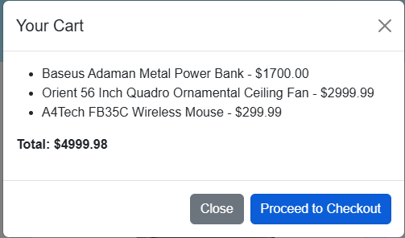

# 🛍️ Basic E-Commerce Website

This is a basic e-commerce website built using HTML, CSS, and JavaScript. It serves as a foundational project to understand the structure and functionality of an online store.

## 🌐 Live Demo

[[View the Live Site]](https://shefat2002.github.io/eCommerce-website/)

## 📂 Project Structure

```
eCommerce-website/
├── index.html
├── styles.css
├── script.js
└── images/
```

- **index.html**: The main HTML file containing the structure of the website.
- **styles.css**: The CSS file for styling the website.
- **script.js**: The JavaScript file handling interactivity.
- **images/**: Directory containing image assets used in the website.

## 🚀 Features

- Responsive design suitable for various devices.
- Interactive product listings.
- Basic shopping cart functionality.
- User-friendly navigation.

## 🛠️ Technologies Used

- HTML5
- CSS3
- JavaScript (ES6)

## 📦 Getting Started

To run this project locally:

1. Clone the repository:

   ```bash
   git clone https://github.com/shefat2002/eCommerce-website.git
   ```

2. Navigate to the project directory:

   ```bash
   cd eCommerce-website
   ```

3. Open `index.html` in your preferred web browser.

## 📸 Screenshots




## 🙋‍♂️ Author

- **Shefat Al Mahmud**
  - GitHub: [@shefat2002](https://github.com/shefat2002)
